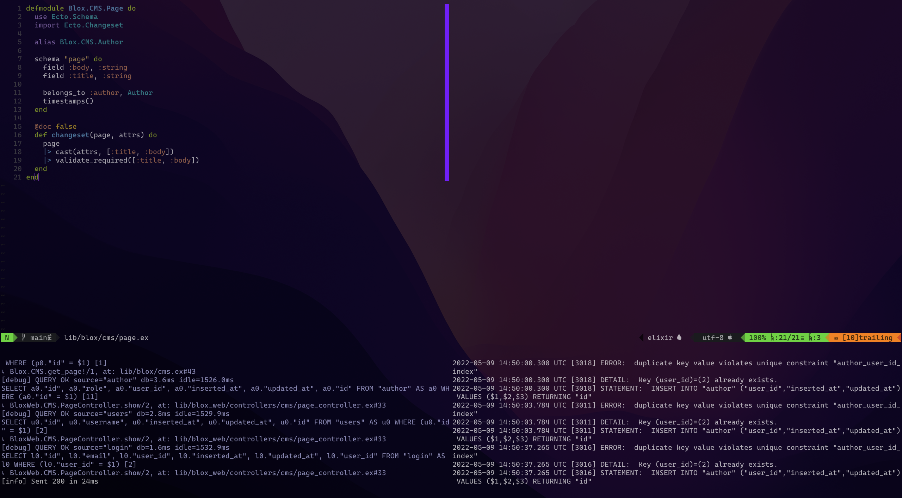

Who doesn't like a good looking terminal and useful layouts and keymaps?
This has always been my goal since I started using linux as main OS.

I have used lots of different terminals, plugins and settings over the years but I think now 
I achieved the glory with my current setup:



Let's have a look to the configuration.

## What do I use?

- Terminal: [Kitty](https://sw.kovidgoyal.net/kitty/)
- Shell: `zsh`
- zsh config management: [Oh my Zsh!](https://ohmyz.sh/)
- zsh theme: [powerlevel10k](https://github.com/romkatv/powerlevel10k)
- editor: [neovim](https://neovim.io/)

## Configuration

### Terminal

To achieve a clean look in the terminal, I changed the opacity of kitty, removed the window title bar,
and changed margins. Here the configuration needed:
```
background_opacity 0.76
draw_minimal_borders yes
window_padding_width 2
window_border_width 0
hide_window_decorations yes
titlebar-only yes
active_border_color none
```

I have also added changes for the tabs bar in order to make it look minimalist:
```
tab_bar_edge top
tab_bar_background none
tab_bar_style powerline
tab_powerline_style slanted
tab_title_template "{fmt.fg.c2c2c2}{title}"

active_tab_title_template "{fmt.fg._fff}{title}"
active_tab_foreground #fff
active_tab_font_style bold-italic
active_tab_background #8631B4

inactive_tab_foreground #c2c2c2
inactive_tab_background #8631B4
```

In order to move quick between splits I added the following mappings:
```
map cmd+shift+up neighboring_window up
map cmd+shift+left neighboring_window left
map cmd+shift+right neighboring_window right
map cmd+shift+down neighboring_window down
```

### powerlevel10k

There is not much to mention here since I have used the powerlevel10k script to configure it.
Once you install powerlevel10k it should init the configuration wizard. If you want to re-configure
do so by running `p10k configure` in your terminal.

You can check my powerlevel10k config file [here](https://github.com/protiumx/.dotfiles/blob/main/stow/zsh/.p10k.zsh).

### neovim

Plugins:
- [vim-airline](https://github.com/vim-airline/vim-airline)

In this case, I got rid of many highlights background colors
```vim
highlight LineNr ctermbg=none
highlight Normal ctermbg=none
highlight NonText ctermbg=none
highlight SignColumn ctermbg=none
highlight VertSplit ctermbg=none ctermfg=98 cterm=none
```
I have also setup a color column to show a visual limit at 100 chars
```
set colorcolumn=100
highlight ColorColumn ctermbg=93
```

My vim-airline config goes like this:
```vim-script
let g:airline_theme='selenized_bw'

" Show git branch
let g:airline#extensions#branch#enabled=1

let g:airline#extensions#hunks#enabled=0
let g:airline_powerline_fonts=1
let g:airline_detect_spell=0

" Short version for modes
let g:airline_mode_map = {
      \ '__'     : '-',
      \ 'c'      : 'C',
      \ 'i'      : 'I',
      \ 'ic'     : 'I',
      \ 'ix'     : 'I',
      \ 'n'      : 'N',
      \ 'multi'  : 'M',
      \ 'ni'     : 'N',
      \ 'no'     : 'N',
      \ 'R'      : 'R',
      \ 'Rv'     : 'R',
      \ 's'      : 'S',
      \ 'S'      : 'S',
      \ ''     : 'S',
      \ 't'      : 'T',
      \ 'v'      : 'V',
      \ 'V'      : 'V',
      \ ''     : 'V',
      \ }
```

That's it! The setup is fairly simple and the results are quite good.

You can have a look at all my config and dotfiles in [here](https://github.com/protiumx/.dotfiles/).

PS: this article has its source on [github](https://github.com/protiumx/blog/blob/main/articles/003/content.md).
I'm using a github action to publish it to different platforms. Read more 
{{#if medium}}
[here](https://medium.com/@protiumx/publish-your-blog-articles-everywhere-with-this-github-action-f80b9f9882a8)
{{/if}}
{{#if devto}}
[here](https://dev.to/protium/publish-your-blog-articles-everywhere-with-this-github-action-3g6k)
{{/if}}

Related articles:
{{#if medium}}
- [Bash + GNU Stow: take a walk while your new macbook is being set up](https://medium.com/@protiumx/bash-gnu-stow-take-a-walk-while-your-new-macbook-is-being-set-up-351a6f2f9225)
- [Kitty configuration for the iTerm user](https://medium.com/@protiumx/kitty-configuration-for-the-iterm-user-41a390579a8c)
- [Vim: Delightful settings and plugins](https://medium.com/@protiumx/vim-delightful-settings-and-plugins-d6debfc2c5df)
{{/if}}
{{#if devto}}
- [Bash + GNU Stow: take a walk while your new macbook is being set up](https://dev.to/protium/bash-gnu-stow-take-a-walk-while-your-new-macbook-is-being-set-up-p1o)
- [Kitty configuration for the iTerm user](https://dev.to/protium/kitty-configuration-for-the-iterm-user-pe4)
- [Vim: Delightful settings and plugins](https://dev.to/protium/vim-delightful-settings-and-plugins-18am)
{{/if}}

:alien:
