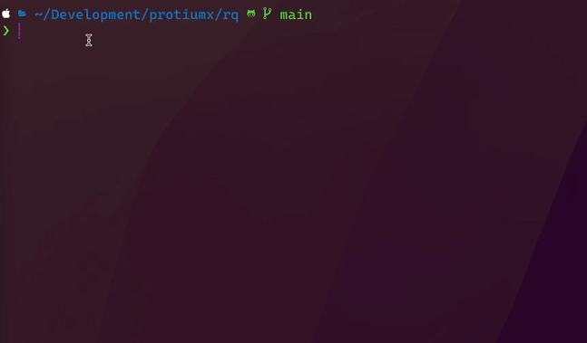
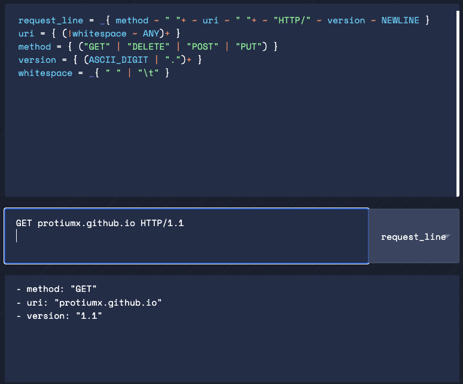
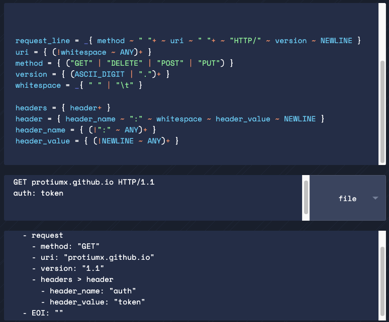
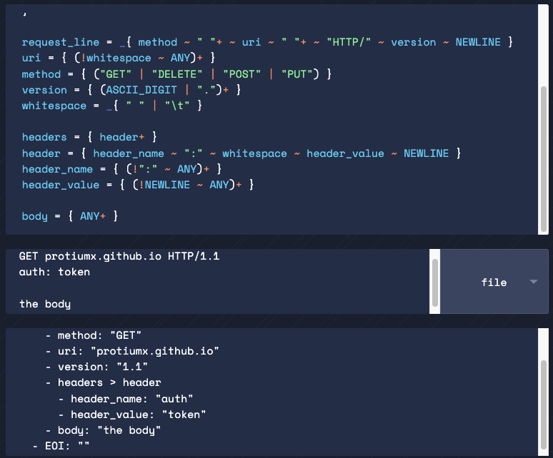
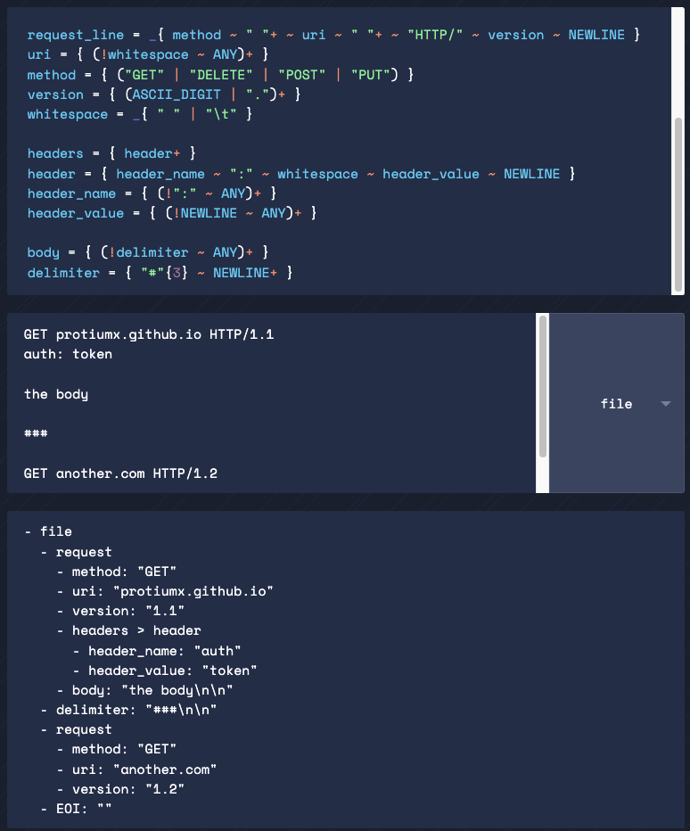
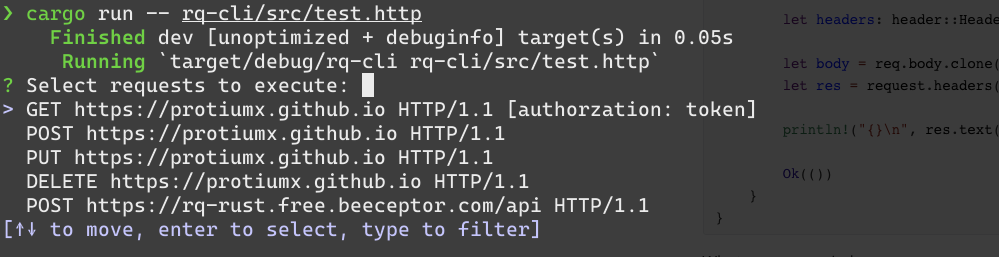

## Introduction

I happened to have learned about [parsing expression grammars](https://en.wikipedia.org/wiki/Parsing_expression_grammar) a few days ago and got really excited about writing my own grammar.
As I was missing this [VS Code extension](https://github.com/Huachao/vscode-restclient) when working on `neovim`, an idea popped up:
**What if I write an HTTP grammar and an execute request from an interactive prompt?**

Preview:



## Preparation

For our grammar, we need to make sure we understand the HTTP standard defined [here](https://www.w3.org/Protocols/rfc2616/rfc2616-sec5.html).
```
Request = Request-Line ; Section 5.1
        *(( general-header        ; Section 4.5
         | request-header         ; Section 5.3
         | entity-header ) CRLF)  ; Section 7.1
        CRLF
        [ message-body ]          ; Section 4.3
```

Let's breakout the definition

### Request

A `Request` is conformed by a `Request-Line` optionally followed by `headers` and a new line (a **Carriage Return** and **Line Feed**) then another new line. After the `headers` we find the `message-body`.

### Request-Line

```
Request-Line = Method SP Request-URI SP HTTP-Version CRLF
```

Here we should fine a `Method` followed by a white space. Then the `Request-URI` followed by a white space. Finally the `HTTP-Version`.

An example of a request can be `GET http://www.w3.org/pub/WWW/TheProject.html HTTP/1.\r\n` (note the end of the line)

### Request-Header

Defined as

```
equest-header = Accept                   ; Section 14.1
      | Accept-Charset           ; Section 14.2
      | Accept-Encoding          ; Section 14.3
      | Accept-Language          ; Section 14.4
      | Authorization            ; Section 14.8
      | Expect                   ; Section 14.20
      | From                     ; Section 14.22
      | Host                     ; Section 14.23
      | If-Match                 ; Section 14.24
      | If-Modified-Since        ; Section 14.25
      | If-None-Match            ; Section 14.26
      | If-Range                 ; Section 14.27
      | If-Unmodified-Since      ; Section 14.28
      | Max-Forwards             ; Section 14.31
      | Proxy-Authorization      ; Section 14.34
      | Range                    ; Section 14.35
      | Referer                  ; Section 14.36
      | TE                       ; Section 14.39
      | User-Agent               ; Section 14.43
```

let's open one of those sections to check the format.

```
Authorization = "Authorization" ":" credentials
```

Basically this header is the word `Authorization` followed by `:` and then the `credentials`.

### Message-Body

```
message-body = entity-body
                    | <entity-body encoded as per Transfer-Encoding>
```

For simplicity let's assume that the `body` can be **anything** that is not a request line nor a header.

Now we have enough information to write our http grammar, more specific a set of **rules**.

## Pest

To write our grammar we will use [pest](https://pest.rs/). From the website:

> pest is a general purpose parser written in Rust with a focus on **accessibility**, **correctness**, and **performance**. It uses [parsing expression grammars (or PEG)](https://en.wikipedia.org/wiki/Parsing_expression_grammar) as input, which are similar in spirit to regular expressions, but which offer the enhanced expressivity needed to parse complex languages.

Sounds great!

Pest has its [own syntax](https://pest.rs/book/grammars/syntax.html) for writing grammar rules. A **rule** is defined as follows:

```
my_rule = { ... }
```

Let's create a new rule `my_rule= { "test" }`. This rule will match the word `test` inside an **input**. So if we want to parse a file that only contains "test" or new lines  we need to define the shape of a line with the delimiters `SOI` and `EOI` (start and end of input respectively)

```
testy_file = {
    SOI
    ~ (my_rule | NEWLINE)*
    ~ EOI
}
```

Let's test this out in the online grammar editor:


The parser has identified a `testy_file` that contains to matches for the rule `my_rule`. So far so good.

## HTTP Grammar

Now we are ready for writing our grammar (are we?). We need to write this grammar as close as possible to the standard, since it's defined in a similar way, with **rules**. We can imagine something like this

```
request = {	
	request_line ~
    headers? ~
    NEWLINE ~
    body?
}
```

Our `request` rule says: a `request_line` optionally followed by `headers` followed by a new line, then optionally followed by the `body`. With optionally I make reference to the `?` mark which is a repetition operator (those who are familiar with regex expressions should understand this right away) and means that something ` can occur zero or one times`. 
For our `request_line` we will match the standard as follows:

```
request_line = _{ method ~ " "+ ~ uri ~ " "+ ~ "HTTP/" ~ version ~ NEWLINE }
```

We are talking about a `method` followed by a blank space then the `uri` then another blank space then the `http version` followed by a `NEWLINE`. `NEWLINE` is a pest built-in rule that matches `"\n" | "\r\n" | "\r"`.

Let's break the request line.

For `method` we just need to match any of the http methods defined in the standard
```
Method = "OPTIONS"                ; Section 9.2
        | "GET"                    ; Section 9.3
        | "HEAD"                   ; Section 9.4
        | "POST"                   ; Section 9.5
        | "PUT"                    ; Section 9.6
        | "DELETE"                 ; Section 9.7
        | "TRACE"                  ; Section 9.8
        | "CONNECT"                ; Section 9.9
```

Therefore our method rule should be

```
method = { ("GET" | "DELETE" | "POST" | "PUT" | ...) }
```

Here our rule says: match the exact word `GET` or `DELETE` or ... you get the idea.

Next, for simplicity purpuses, we will say that the `uri` is anything that is **not** a blank space

```
uri = { (!whitespace ~ ANY)+ }
whitespace = _{ " " | "\t" }
```

**Note:** here we also defined that the `white space` can be a space or a tab. Note that `_` means that the rule is [silent](https://pest.rs/book/grammars/syntax.html#silent-and-atomic-rules); it does not produce tokens.

The HTTP version goes like:

```
version = { (ASCII_DIGIT | ".")+ }
```

Meaning: any digit or a dot character. In our `request_line` the version is defined as the word "HTTP/" followed by the `version`.

Finally, we require a `NEWLINE` at the end of our request line.

Let's test this out on the editor.



Perfect! Note that the `whitespace` rule does not produce a token, we only see `method`, `uri` and `version`. Let's continue with the headers.

```
header = { header_name ~ ":" ~ whitespace ~ header_value ~ NEWLINE }
header_name = { (!(":" | NEWLINE) ~ ANY)+ }
header_value = { (!NEWLINE ~ ANY)+ }
```

In here we say that a `header_name` is anything except for `:` , because this character is a **header separator**, it delimits the header name. We also don't want a new line, we will see why bellow.
The name is followed by the separator `:` and then 1 white space.
The `header_value` is anything except for a **new line**, because the new line delimits a `header`. After the value we encounter a new line.

Let's test this again:



Here we can se that the parser matches 1 header as `{ header_name: "auth", header_value: "token" }`. Did you notice that it also say `headers > header` ? That is because we also want a rule that can matches a 1 or more `header` rules. We define this rule as:

```
headers = { header+ }
```

This way the pest parser will produce a token `headers` with a list of `header` matches.

Lastly the body:

```
body = { ANY+ }
```

The body is anything after the headers



So far our grammar can parse 1 request from the input. Coming back to the original idea for this post, we want to be able to parse multiple http requests from a file. But here we have a conflict because our `body` rule will match anything after the headers, and that anything can be another request.
To solve this problem we need the help of a :sparkles: delimiter :sparkles:

## The .http file syntax

To delimit each http request in our file we will make use of 3 `#` symbols (as the VS Code rest client does).
Let's go add this to our grammar:

```
delimiter = { "#"{3} ~ NEWLINE+ }
```

Our delimiter is exactly 3 number signs followed by 1 or more new lines. Then we can say that the `body` is anything except for a delimiter:

```
body = { (!delimiter ~ ANY)+ }
```

Let's test this:



Nice! So finally we can define what our http file should look like:

```
file = { SOI ~ (delimiter | request)* ~ EOI}
```

Our http file is composed by delimiters or requests, 0 or more of them.
We have completed our http grammar, now it's time to get **rusty**


## Parsing http files

We will refer to [this example](https://pest.rs/book/examples/ini.html) for setting up the base code 

```rust
extern crate pest;
#[macro_use]
extern crate pest_derive;

use pest::Parser;

#[derive(Parser)]
#[grammar = "grammar.pest"]
struct HttpParser;
```

We will use the following file for testing

```
GET https://protiumx.github.io HTTP/1.1
authorization: token

###

POST https://rq-rust.free.beeceptor.com/api HTTP/1.1

{
  "hello": "hola"
}
```

**Note:** I set up a mock api in https://beeceptor.com/. It might not be available by the time you are reading this. But you can use any endpoint that accepts **POST**.

Let's go ahead an parse the file

```rust
fn main() {
    let unparsed_file = fs::read_to_string("test.http").expect("cannot read file");

    let file = INIParser::parse(Rule::file, &unparsed_file)
        .expect("unsuccessful parse") // unwrap the parse result
        .next().unwrap(); // get and unwrap the `file` rule; never fails

		println!("{:#?}", file);
}
```

we get: 

```
Pair {
    rule: file,
    span: Span {
        str: "GET https://protiumx.github.io HTTP/1.1\nauthorzation: token\n\n###\n\nPOST https://rq-rust.free.beeceptor.com/api HTTP/1.1\n\n{\n  \"hello\": \"hola\"\n}\n",
        start: 0,
        end: 142,
    },
    inner: [
        Pair {
            rule: request,
            span: Span {
                str: "GET https://protiumx.github.io HTTP/1.1\nauthorzation: token\n\n",
                start: 0,
                end: 61,
            },
            inner: [
                Pair {
                    rule: method,
                    span: Span {
                        str: "GET",
                        start: 0,
                        end: 3,
                    },
                    inner: [],
                },
...
```

The `Pair` struct has a pretty clear structure and we could use to print each inner `Pair`. But we want to get rusty so we will put some effort.

We will define an `HttpFile` struct. This struct will contain a vector of `HttpRequest`.
Let's define them:

```rust
use std::collections::HashMap;

#[derive(Debug)]
pub enum HttpMethod {
    Get,
    Post,
    Put,
    Delete,
  	// ...
}

#[derive(Debug)]
pub struct HttpRequest {
    pub method: HttpMethod,
    pub url: String,
    pub version: String,
    pub headers: HashMap<String, String>,
    pub body: String,
}

#[derive(Debug)]
pub struct HttpFile {
    pub requests: Vec<HttpRequest>,
}
```

And to get even more rusty we will implement the `TryFrom` trait to each struct. Let's implement it for the `HttpFile`

```rust
impl<'i> TryFrom<Pair<'i, Rule>> for HttpFile {
    type Error = Error<Rule>;

    fn try_from(pair: Pair<Rule>) -> Result<Self, Self::Error> {
        let iterator = pair.into_inner();
        let mut requests = vec![];
        for item in iterator {
            match item.as_rule() {
                Rule::EOI => {
                    break;
                }
                Rule::request => {
                    requests.push(item.try_into()?);
                }
                _ => {}
            }
        }
        Ok(Self { requests })
    }
}
```

**Note:** `Pair<'i, Rule>` has the lifetime of the `input`.
As we know, the `file` rule can contain 0 or more of (delimiter | request). This means that in its content we can find: delimiter, request or End of File.
Here we will **try** to parse each request, so we need the `TryFrom` trait for the `HttpRequest` struct

```rust
impl<'i> TryFrom<Pair<'i, Rule>> for HttpRequest {
    type Error = Error<Rule>;

    fn try_from(pair: Pair<'i, Rule>) -> Result<Self, Self::Error> {
        let mut iterator = pair.into_inner();
        let mut ret = Self {
            method: iterator.next().unwrap().try_into()?,
            url: iterator.next().unwrap().as_str().to_string(),
            version: iterator.next().unwrap().as_str().to_string(),
            headers: HashMap::new(),
            body: String::new(),
        };

        for item in iterator {
            match item.as_rule() {
                Rule::headers => {
                    ret.parse_headers(item.into_inner());
                }
                Rule::body => {
                    ret.body = item.as_str().to_string();
                }
                _ => {
                    unreachable!();
                }
            }
        }

        Ok(ret)
    }
}
```


Each `request` can have 5 inner matches: method, url, version, headers and body.
The first 3 do not have inner rules, so we can just extract them as `&str`. After this, the iterator can only have `headers` or `body` pairs. For the `headers` we perform a similar operation:

```rust
impl HttpRequest {
    fn parse_headers(&mut self, pairs: Pairs<Rule>) {
        for item in pairs {
            let mut kv = item.into_inner();
            let key = kv.next().unwrap().as_str().to_string();
            let value = kv.next().unwrap().as_str().to_string();
            self.headers.insert(key, value);
        }
    }
}
```

Grapes! We are pretty much done with the parser. Now let's use the parsed content to make the requests.

## reqwest

After a quick check of the available rust http client libraries I opted for [reqwest](https://crates.io/crates/reqwest). It has a pretty simple API and it seems to be among the most used libraries for this matters. But I'm a bit concerned about all its dependencies so I might try [ureq](https://github.com/algesten/ureq) later.

For this part I just followed the examples on the docs website and ended up with this code:

```rust
#[derive(Default)]
pub struct HttpClient {
    pub client: reqwest::blocking::Client,
}

impl HttpClient {
    pub fn new() -> Self {
        let mut headers = header::HeaderMap::new();
        headers.insert(
            header::CONTENT_TYPE,
            header::HeaderValue::from_static("application/json"),
        );
        headers.insert(
            header::ACCEPT,
            header::HeaderValue::from_static("application/json"),
        );

        let client = reqwest::blocking::Client::builder()
            .timeout(Duration::from_secs(10))
            .default_headers(headers)
            .no_gzip()
            .build()
            .unwrap();
        HttpClient { client }
    }

    pub fn execute(&self, req: &HttpRequest) -> Result<(), Box<dyn std::error::Error>> {
        let request = self
            .client
            .request(Method::from_str(req.method.to_string().as_str())?, &req.url);

        let headers: header::HeaderMap = (&req.headers).try_into()?;

        let body = req.body.clone();
        let res = request.headers(headers).body(body).send()?;

        println!("{}\n", res.text()?);

        Ok(())
    }
}
```

What we can see in here:

- Use the `ClientBuilder` to add some default headers and config for the request
- Parse our `HttpMethod` into `reqwest::Method`. **Note:** `HttpMethod` implements the `Display` trait.
- Parse our `HashMap<String, String` of headers into `reqwest::header::HeaderMap`. This is possible because it implements the `TryFrom<HashMap<String, String>>` trait.
- Finally clone the body and send the request. We output the body of the request as `text` (this consumes the body)

**Note:** We are not trimming the body, perhaps we should.

No we are ready for the last part: the interactive prompt

## Lazyness kicks in

At this point I felt a bit lazy to implement the prompt so I searched for existing solutions, one of them being [inquire](https://github.com/mikaelmello/inquire). It has a pretty straight forward API, so to show an interactive select we just need this lines:

```rust
    let http_file = parse(&file_content).unwrap();

    let request = Select::new("Select requests to execute:", http_file.requests)
        .prompt()
        .unwrap();

    let client = HttpClient::new();
    client.execute(&request)?;
```

Note that the `HttpRequest` implements the `Display` trait. 

The result:



Gorgeous.

## Unintroduction

This project turned out to be quite fun! I ended up naming it `rq` and you can see its source [here](https://github.com/protiumx/rq/)

My goal is to have a full interactive prompt that allows you to execute many request without existing the prompt mode.
If you would like to collaborate I have created a few TODO cards [here](https://github.com/protiumx/rq/projects/1).

That's it. Thanks for reading :alien:

Others posts:

Related articles:
- [Publish your blog articles everywhere with this github action]()
- [Coding Problems, TDD, and CI](https://dev.to/protium/coding-problems-tdd-and-ci-282n)
- [Your new pretty and minimalist resume with LaTex](https://dev.to/protium/your-new-pretty-and-minimalist-resume-with-latex-421j)
