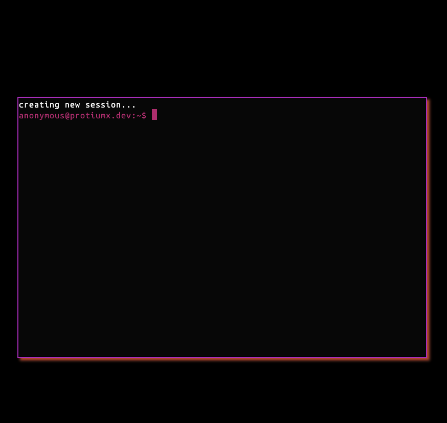
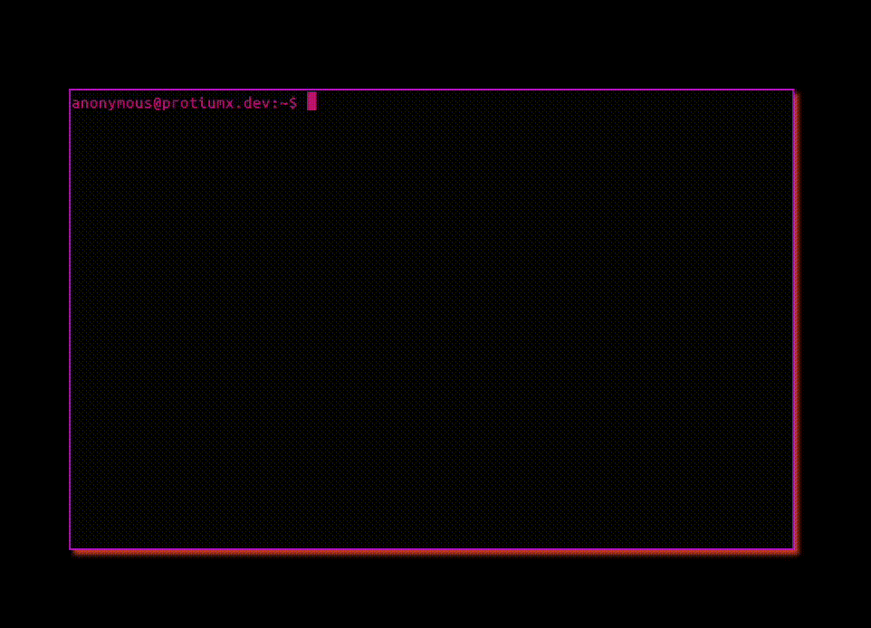

When I was younger I used to think that my profile website would be a really cool, fully featured website, with shiny colors and animations; built with the latest cutting edge frontend technology...
Turns out that the older I get the more I prefer a simple terminal. No UI, just text and commands.

The last time I updated my profile website, it looked like this:


It was already pretty minimalistic, right? But not enough. Now my profile website is just a terminal:



Let's see how this was possible.

## A pragmatic approach

A few days ago I was shaping this idea on my head and found this library: [xterms](https://xtermjs.org/). It's been used by a lot of apps, VS Code being among them. I decided to give it a try to see how complex could it be, so I headed to the [docs](https://xtermjs.org/docs/) and started adding the code to my website. As you can see the docs are pretty good, they are surely autogenerated from TS docs but this is good because it means the code itself is well documented.

Before starting coding I set a few requirements:

- I don't want to use `npm` modules. I want my website source to be simple and minimal
- I want to make use of [javascript modules](https://developer.mozilla.org/en-US/docs/Web/JavaScript/Guide/Modules) which are supported by all (relevant) browsers
- The terminal commands should be abstract to allow me to remove or add commands at will with a few changes

Then, how do I install `xtermjs` without using `npm`? The solution is simple, I host the files. I extracted the files from the npm packages with this command

```sh
npm v xterm dist.tarball | xargs curl | tar -xz
```

and moved `package/lib/xterm.js` into `app/`

To use javascript modules, I just needed to import the `main.js` file as module

```html
<script type="module" src="./app/main.js"></script>
```

## Terminal Commands

Although not using `typescript` let's say that the terminal commands implement the following interface

```ts
interface Command {
  id: string;
  description: string;
  usage: string;
  args: number;
  run: (terminal: Terminal) => Promise<void>;
}
```

Then we need a command runner that will parse the user input

```tsx
interface CommandRunner {
  (term: Terminal, userInput: string) => Promise<boolean>;
}
```

The runner will return `false` if a command was not found. 
Let's now define 1 command:

```ts
const lsCommand =   {
  id: "ls",
  description: 'list files',
  usage: '[usage]: ls filename'
  args: 0,
  async run(term, args) {
    for (const file of files) {
      term.write(file.name + '\t\t');
    }
  },
};
```

Now that we shaped the `command`, we can think of handling user input.

## Terminal basic functionality

The terminal should support:

- It should show a `prompt`

- `ctrl + l`: should clear the terminal
- `ctrl + c`: should mean `SIGINT`
- `enter`: should run a command from the current user input

The terminal should also handle common errors:

- command not found
- command with wrong arguments

With this in mind we can start handling the user input.

`xterm` provides a `onKey` event which receives a handler function `({ key, domEvent }) => void`, so we receive an event per each key press done by the user. This means that we need to track the user input and add each key as a char. When the user presses `enter` we should evaluate the input we have so far. Pretty straigt forward

```js
let userInput = '';
if (ev.keyCode == 13) {
  await runCommand(term, userInput);
  userInput = '';
  prompt(term);
} else {
  term.write(key);
  userInput += key;
}

```

**NOTE:** `xterm` doesn't render the user input, so we need to do it when it makes sense (not enter, not an arrow key, etc)

Handling the clear-screen can be implemented as

```js
if (ev.ctrlKey && ev.key === 'l') {
  term.clear();
  return;
}
```

and the `SIGINT`

```js
if (ev.ctrlKey && ev.key === 'c') {
  prompt(term);
  userInput = '';
  return;
}
```

At this point we have a pretty basic working terminal, so let's add some more commands

## Basic commands

What are the most known commands? For my terminal I want to be able to use `cat`, `ls`, `rm`, `exit`. But remember that this terminal is actually my profile website, so they should make sense in that context. So I decided the terminal should have a file system, where files are shaped like

```ts
interface File {
  name: string;
  content: string;
}
```

Example

```js
const files = [{ name: "about.md", content: "once upon a time"}];
```

With this in mind, `cat` will print the file content, `ls` will print each file's name and `rm` will delete the file from the array.

For the `exit` command we can just close the window from javascript: `window.close()`.


## Going further

I have decided that I wanted to have a file named `blog.md` which should contain my last 5 posts.
To fetch this info, I used the RSS feed xml file generated by [hugo](https://gohugo.io/) for my [blog](https://protiumx.dev/blog/). All I need to do is to fetch the file, parse the `xml` document and get the title and links of each post:

```js
export async function fecthLastPosts() {
  const res = await fetch('/blog/index.xml');
  const text = await res.text();
  const parser = new DOMParser();
  const xmlDoc = parser.parseFromString(text,"text/xml");
  const posts = xmlDoc.getElementsByTagName('item');
  const lastPosts = [];
  for (let i = 0; i < 5; i++) {
    const title = posts[i].getElementsByTagName('title')[0].childNodes[0].nodeValue;
    const link = posts[i].getElementsByTagName('link')[0].childNodes[0].nodeValue;
    lastPosts.push(title + `\r\n${link}\r\n`);
  }

  files[0].content = lastPosts.join('\n');
}
```

Now `cat blog.md` prints my last 5 posts, and thanks to the `web link` addon of `xterm` each link is clickeable. Noice.
But why stopping here? Every `hackerman` terminal should have a `whoami` command. So this command will just print information about my self.

Also, cool web apps contain photos of cats, so I decided to write a `randc` command what will open a rando photo of a cat.
For this I found this amazing [rest API](https://cataas.com/#/)

```js
  {
    id: "randc",
    description: 'get a random cat photo',
    args: 0,
    async run(term, args) {
      term.writeln('getting a cato...');
      const res = await fetch('https://cataas.com/cat?json=true');
      if (!res.ok) {
        term.writeln(`[error] no catos today :( -- ${res.statusText}`));
      }  else {
        const { url } = await res.json();
        term.writeln(colorize(TermColors.Green, 'opening cato...'));
        await sleep(1000);
        window.open('https://cataas.com' + url);
      }
    },
  },
```

The result:




I think this should do it for a `profile terminal`. I'm very satisfied with the simplicity of it and the commands I have implemented.
I'll problaly add more commands in the future and also implement `streams` , just for fun.

What command would you add to your **profile terminal**?
Go have some fun with it: https://protiumx.dev

## Update:
I have refactored the project structure to improve readability and make it more generic.
It also loads your command history from the local storage. All the changes can be seen here: https://github.com/protiumx/protiumx.github.io/pull/1

Other articles:

- [Publish your blog articles everywhere with this github action](https://protiumx.dev/blog/publish-your-blog-articles-with-this-github-action/)
- [An HTTP request parser with rust and pest.rs](https://protiumx.dev/blog/an-http-request-parser-with-rust-and-pest-rs/)

:alien:
