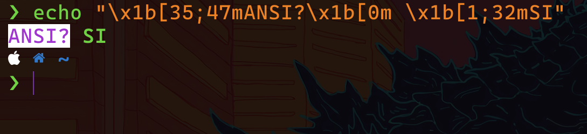
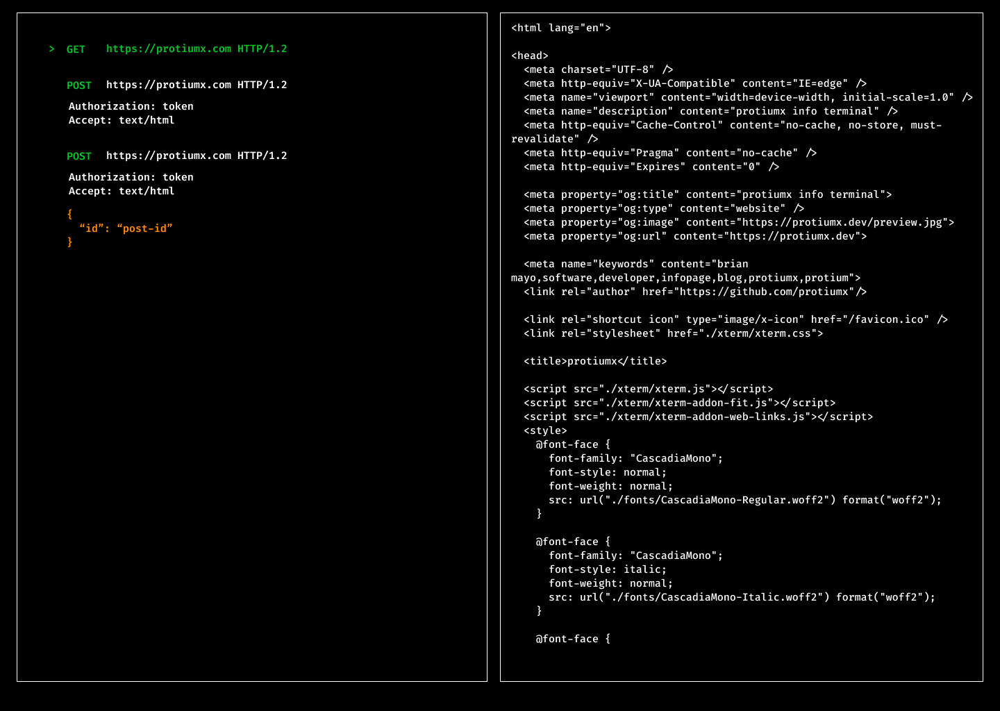
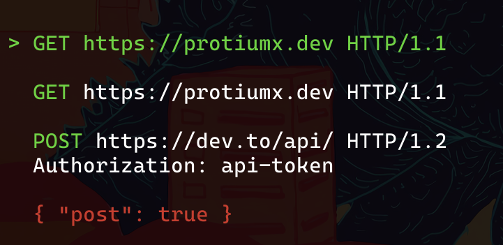
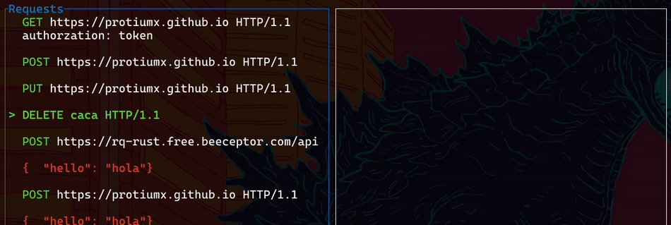

## Intro

Continuing with my last project [rq](https://github.com/protiumx/rq), I recently started to work on
this project card: [Implement interactive prompt](https://github.com/protiumx/rq/projects/1#card-82259239).
Let's have a look how can we implement a **text-based UI** with `rust`.

## The ANSI Standard

Before we dive into the wonderful world of terminal emulators and text-based interfaces, 
we need to understand what the **ANSI escape sequences** are:

> ANSI escape sequences are a standard for in-band signaling to control cursor location, color, font styling, and other options on video text terminals and terminal emulators. 
>
> Source: https://en.wikipedia.org/wiki/ANSI_escape_code

By using ANSI sequences we can tell the terminal emulator how to render text, change the cursor position, 
clear the screen, etc. In my last [post](https://dev.to/protium/my-profile-website-is-now-a-terminal-2j57)
I used these sequences to implement a very basic shell for my [profile website](https://protiumx.dev).

Let's see some examples. Head to your favorite terminal emulator (I use [kitty](https://sw.kovidgoyal.net/kitty/)):
```sh
echo "\x1b[35;47mANSI? \x1b[0m\x1b[1;32mSI"
```


Analysis:
- `\x1b`: this is the hexadecimal for `ESC` (escape). It starts the escape sequence
- `[`: is the [control sequence introducer](https://en.wikipedia.org/wiki/ANSI_escape_code#CSIsection)
- `35;47m`: the SGR (Select Graphic Rendition) where `35` sets the `foreground` color to magenta and
`47` sets the `background` to white. `m` is the final character specified by the standard
- `\x1b[0m`: it's a special sequence to reset or turn all attributes off
- `\x1b[1;32m`: Sets foreground to green and add the `bold` attribute

Lets try this in rust:
```rs
println!("\x1b[35;47mANSI? \x1b[0m\x1b[1;32mSI");
```
It should have the same result as with the `echo` command above.

Another example:
```rs
println!("\x1b[2J");
```
According to the standard `[2J` erases entire display.

## Designing the text-based interface

As a loyal user of (neo)vim, I love the concept of buffers. I want my app to have 2 buffers,
one for the list of HTTP requests and one for the current response:



Let's start from scratch. To enter into the "interactive" mode, we need to clear the whole screen.
For that we will use the following escape sequences:
```rust
println!("\r\x1b[2J\r\x1b[H");
```


1. `\r`, carriage return. We go all the way to the left
2. As explained before, `[2J` clears the entire screen
3. `[H` moves the cursor to `home`, or the corner top-left of the terminal (col 1, row 1).

Nice, an empty screen.
Next I want to draw the requests the program loaded  from the `http` file 
(for context: I have published this [article](https://protiumx.dev/blog/posts/an-http-request-parser-with-rust-and-pest.rs/)
about how to parse HTTP request with rust). Based on the design, the selected request should print the 
HTTP method in green, URL in white and body in orange. If the request is selected, the whole request line should be green.
Let's write a helper function:

```rust
fn draw_request(req: &HttpRequest) -> String {
  let mut request_line = format!("{} {} HTTP/{}", colorize(Color::Green, req.method), req.url, req.version);
  if !req.header.is_empty() {
    request_line = format!("{}\r\n{:?}\r\n", request_line, req.headers);
  }
  if !req.body.is_empty() {
    request_line = format!("{}\n{}", request_line, colorize(Color::Orange, req.body.as_str()));
  }
}
```
If you followed along my last post, you may have an idea of what the `colorize` function looks like.

Now we are able to print all the request. Since we will use `>` to visually mark which request is 
selected, we need to cater some space for it, hence we will print two empty spaces before each request start:

```rust
for req in http_file.requests {
  println!("  {}\n", draw(&req));
}

// go home 
println!("\x1b[H");
// print the cursor >
print!("\x1b[32m>");
```

Results:


## User interaction

The user should be able to navigate between requests with the **arrow keys**. To achieve this we will need:
- Track the current cursor position (column and row)
- Move the cursor down or up according to the user input
- Redraw the interface (clean the screen and draw)

We can compare this flow to how a game engine works: we evaluate changes and use the engine to draw the game 
in its current state.

Since I want to finish this project in less than a month, I have decided to take a look at the different
options in `rust` for building a `TUI`. There are a few options that I can use as a TUI "engine".

I opted for [tui-rs](https://github.com/fdehau/tui-rs/) which is being used by some of my favorite 
terminal apps like [bottom](https://github.com/ClementTsang/bottom). I headed over the [examples](https://github.com/fdehau/tui-rs/tree/master/examples)
and used the `list` example as a base.

After a small refactor:
```rust
fn ui<B: Backend>(f: &mut Frame<B>, app: &mut App) {
  // Split the screen into 2 vertical portions
  let chunks = Layout::default()
      .direction(Direction::Horizontal)
      .constraints([Constraint::Percentage(50), Constraint::Percentage(50)].as_ref())
      .split(f.size());

  let items: Vec<ListItem> = app
      .requests
      .iter()
      .map(|req| ListItem::new(draw_request(req)))
      .collect();

  let mut list_block = Block::default().borders(Borders::ALL).title("Requests");
  let list = List::new(items)
      .highlight_style(
          Style::default()
              .add_modifier(Modifier::BOLD)
              .fg(Color::Green),
      )
      .highlight_symbol("> ");

  f.render_stateful_widget(list.block(list_block), chunks[0], &mut app.list);
}
```
So we are at the same point as when using ANSI escape sequences to render the UI.
This time we can easily implement a key handler and deal with the user interaction:

```rust
match event::read()? {
    Event::Key(key) => match key.code {
        KeyCode::Down => app.next(),
        KeyCode::Up => app.previous(),
        _ => {}
    },
}
```
where `app` is an instance of the `App` struct:

```rust
struct App {
    list: ListState, // from tui-rs
    requests: Vec<HttpRequest>,
    response_buffer: String,
}

impl App {
    fn next(&mut self) {
        let mut i = self.list.selected().unwrap() + 1;
        if i >= self.requests.len() {
            i = 0;
        }

        self.list.select(Some(i));
    }

    fn previous(&mut self) {
        let mut i = self.list.selected().unwrap();
        if i == 0 {
            i = self.requests.len() - 1;
        } else {
            i -= 1;
        }
        self.list.select(Some(i));
    }
}
```
Sweet! Now it is possible to navigate between requests:



## Sending HTTP requests

Once the app is interactive and we can select a request, we can implement a handler for the `Enter` key as follows:

```rust
// impl App ...
fn selected_request(&self) -> HttpRequest {
    self.requests[self.list.selected().unwrap()].clone()
}

//....

KeyCode::Enter => {
  let req = app.seleted_request();
  let data = match rq_core::request::execute(&req).await {
    Ok(r) => r,
    Err(e) => e.to_string(),
  };
  app.response_buffer = data;
}
```
I have implemented the `execute` function in the last post, you can take a look at the source [here](https://github.com/protiumx/rq/blob/main/rq-core/src/request.rs).

The UI is practically finished: the user can navigate with arrow keys and hit `Enter` to execute a request.

## Bonus: Multi-threading

The problem we are facing now is that, even though the request is executed `async` with `tokio`, it is 
blocking the main thread because we are `awaiting` it. If we send a slow request, the UI won't receive updates nor 
key events until the request is done.

A proper solution would be to `spawn` a new thread to perform the request and assign the response to the app `response_buffer` once it finishes.
If you have worked before with a compiled language like `C++` or `C#`, you will know that we need to access to 
the `app` variable in a **thread-safe** way by using a `mutex` (mutual exclusion object):
In short, we want to **block** any other thread from accessing to the `app` state at the same time that we want to change it.

Furthermore, we also need to take into account the lifetime checks made by the rust compiler.
If we simply **move** a variable into a new thread, its ownership is moved and thus the variable is killed once 
the thread finishes. The solution? use a `pointer` to "leak" the `app` variable into another thread.

Without entering into details that are out of the scope of this article, I will use an [Atomically Reference Counted](https://doc.rust-lang.org/std/sync/struct.Arc.html),
from the rust **standard library**, to create a shared pointer of a `Mutex`. The multi-thread implementation looks like:
```rust
// app_arc: Arc<tokio::sync::Mutex<App>>

KeyCode::Enter => {
  // create a new reference
  let app_arc = app_arc.clone();
  tokio::spawn(async move {
      // the ownership of app_arc was now moved into this thread
      let data = match rq_core::request::execute(&req).await {
          Ok(r) => r,
          Err(e) => e.to_string(),
      };
      // here we use the tokio Mutex to lock our variable since we want to write data into it
      let app = app_arc.lock().await;
      app.response_buffer = data;
      // at this point the thread exists and app_arc is killed.
      // app is also killed, unlocking it.
  });
}
```

The result:


As you can see, we can navigate while a request is being executed. The UI keeps responsive. Perfect!

This is it for today, I hope you learned something new.

You can check out the repo [here](https://github.com/protiumx/rq).
If you would like to collaborate with this project there are some TODOs over [here](https://github.com/protiumx/rq/projects/1).

Thanks for reading!

**Other articles:**
- [My profile website is now a terminal](https://protiumx.dev/blog/posts/my-profile-website-is-now-a-terminal/)
- [An HTTP request parser with rust and pest.rs](https://protiumx.dev/blog/posts/an-http-request-parser-with-rust-and-pest.rs/)
- My dotfiles: https://github.com/protiumx/.dotfiles
- My blog source: https://github.com/protiumx/blog

:alien:
