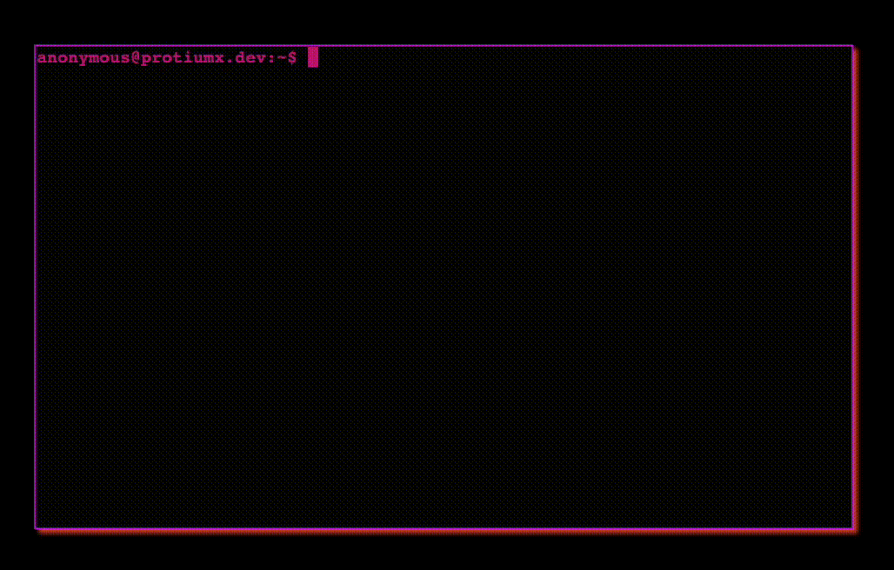
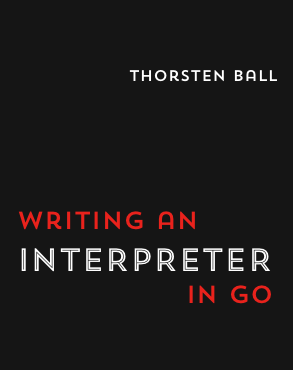

A few weeks ago I started reading [Writing An Interpreter In Go](https://interpreterbook.com/) and 
while reading it and implementing the interpreter a question popped up: what if I can run this
interpreter in the terminal in my website?

To recap, a few months ago I decided to transform my personal [website](https://protiumx.dev) into 
a terminal (read more about it [here](https://protiumx.dev/blog/posts/my-profile-website-is-now-a-terminal/)).
In today's post I'll give an overview of the whole implementation, but first a preview:



You can try it by typing `simia` in the terminal [here](https://protiumx.dev)

## The book: a great resource for learning about interpreters



Although this post is not a book review, I'd like to say that it was a really nice reading.
You can learn from the basics of tokenization to the evaluation of the parsed input.
The author does a great job guiding the reader through all the concepts with concrete examples.
If you want to learn about how interpreters and REPL work this book is definitely a great start!

## Extending the Monkey language

In the book, the author introduces us to the `Monkey` language.
Its syntax is quite simple and that motivated me to add more expressions and syntax, essentially extending
the language to my desire. I wanted to create a language that would combine syntax from `go`, `rust`, and
`elixir`. And that's how [simia](https://github.com/protiumx/simia) was born.
I'm still working on it but so far I have added support for:
- `Range` expressions
- `for-loop` expressions along with the infix operator `in`. e.g. 
```
for a in 1..10 { 
  log(a); 
}
```
- Support for boolean condition in `for-loop`

```
for a > 0 { 
  log(a); 
}
```
- Parentheses are optional for `if` and `for-loop` expressions
- Support for elixir's `pipe` operator `|>`
```
8 |> factorial() |> add(100)
```
- Re-assign variables with `=` operator
```
let foo = "bar";
foo = "1234";
```

And in my TODO list:
- Support modules
- Support `pub` key
- Add more built-ins for arrays, strings, and maps
- Support `mut` key and control mutability

Overall, I want `simia` to be some sort of modern functional programming language.

## Loading the interpreter in the browser: WebAssembly
If you are not familiar with `wasm`, here a quote from https://webassembly.org/
> WebAssembly (abbreviated Wasm) is a binary instruction format for a stack-based virtual machine.
Wasm is designed as a portable compilation target for programming languages, enabling deployment on
the web for client and server applications.

Basically it allows us to convert the `simia` interpreter (written with golang) into a set of instructions that the browser
can understand and execute.

Doing this in `golang` was really simple thanks to the [syscall/js](https://pkg.go.dev/syscall/js)
package and the arch `wasm` when compiling the interpreter.
Let's see a simple example:
```go
// main.go

package main

import (
    "syscall/js"
)

func main() {
    done := make(chan struct{}, 0)
    js.Global().Set("wasmHash", js.FuncOf(hash))
    <-done
}

func hello(this js.Value, args []js.Value) any {
    return "hello " + args[0].String()
}
```

Notice the `channel` we keep waiting for input. This is necessary because the wasm module **it is an application**
and not a library. So this application should keep running and not exit as soon as `js.Global()...` is executed.

Now we compile the app to wasm:
```
GOOS=js GOARCH=wasm go build -o hello.wasm ./main.go 
```

In order to load our wasm we need to use the wasm tools go provides
```
cp "$(go env GOROOT)/misc/wasm/wasm_exec.js" . 
```
and now the final bit, we load the wasm from js and use our wonderful `hello` function:
```html
<html>
<head>
    <meta charset="utf-8"/>
    <script src="wasm_exec.js"></script>
    <script>
        const go = new Go();
        WebAssembly.instantiateStreaming(fetch("hello.wasm"), go.importObject).then((result) => {
            go.run(result.instance);
            console.log(window.hello("universe")); // hello universe
        });
    </script>
</head>
<body>
</body>
```
And that's it, serving the file and opening it in a browser should show the result in the developer console.
I took exactly the same steps to compile and use the `simia` interpreter in the browser.
The wasm module exports to objects:
- `simia`: a function that evaluates simia code and returns the result
- `simia_version`: the version of the interpreter

### Caveats
All was going beautifully but I had to step back to think about a problem: `simia` has a built-in function
called `log` which prints values to the stdout using the `fmt` package.
When compiled to wasm, the `fmt.Println` will use `console.log` as a buffer, so any `log` instruction will be print
into the browser console.

The solution is to modify the built-in to use a buffer and then pass some sort of buffer from javascript,
so then I can use that buffer to print to the terminal element. I will probably will solve this during the
weekend, but if you have a better idea please let me know in the comments.

## Extending my website terminal

When I came up with the idea of adding the REPL into my website, I took a look at the existing code in my website
and identified the requirements needed to make this happen:
- The wasm module can be loaded on demand, i.e. the first time the user calls `simia` from the terminal
- Commands should be able **take** the std in and out.
- The REPL will use the `wasm` module to eval the user input
- `ctrl-c` should "kill" the process and return to the shell

In other to implement this requirements I have prepared a few refactors:
- Improve error handling, e.g. "command missing", "wrong arguments", etc
- Improve key presses handling and extract common functionality
- Introduce `processId`. When a command execution returns a process Id it means that the main function, let's call it
shell, should stop processing the input. Once the command exits it should call a callback to restore the main function.

That's it, I can say that now my terminal has a fully working simia REPL.

## Outro
I had a lot of fun writing the interpreter and loading it into my terminal website, I definitely learned 
a lot of things in the process. I think writing an interpreter is quite a good practice for any developer.

All the changes I made to my website were introduced in this [PR](https://github.com/protiumx/protiumx.github.io/pull/4/files)

What else would you add to the language or the terminal?
I'm planning to do some sort of treasure hunt in my website, stay tuned!

:alien:
